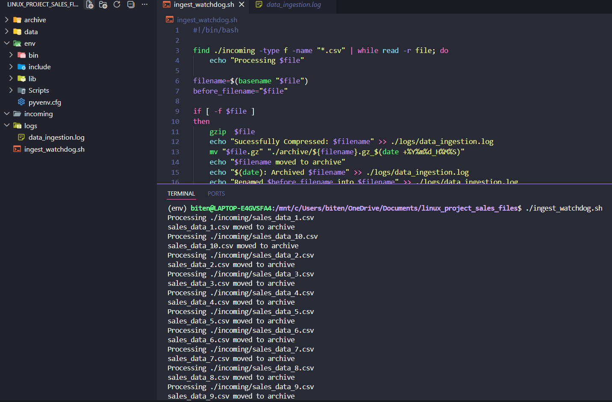
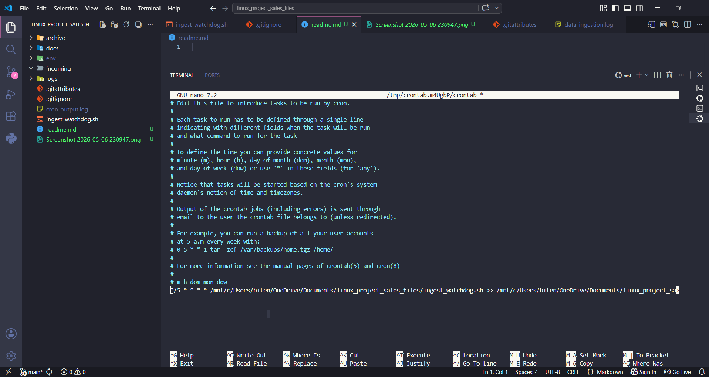

# Ingestion Watchdog

A Bash automation tool that monitors incoming data files, validates them, compresses them using `gzip`, archives them with timestamps, and logs every action for durability tracking.
 
## What does it actually do:

- Monitors `/data/incoming` for new files.
- Validates incoming `.csv` files only
- Compresses files using `gzip`
- Archives the files with timestamped filenames.
- Logs all actions to `/var/log/data_ingest.log` and  ```/var/log/cron_job.log``` 
- Runs automatically every 5 minutes using Cron

---

### Script Running Successfully

```

```

---

### Cron Job Setup

```

```


## Setup Cron Job

Open crontab:

```
crontab -e
```

Add this line:

```
*/5 * * * * /path/to/ingest_watchdog.sh
```

This runs the script every 5 minutes.

---

## Known Issues

- Currently validates only `.csv` files
- No retry mechanism for failed file operations
- Script assumes required directories already exist


`**Contributions are welcome.**`